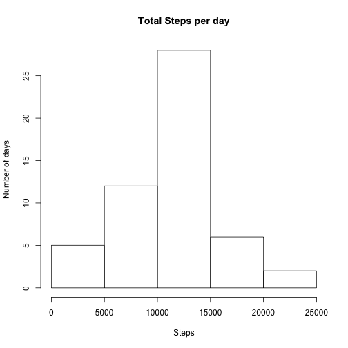
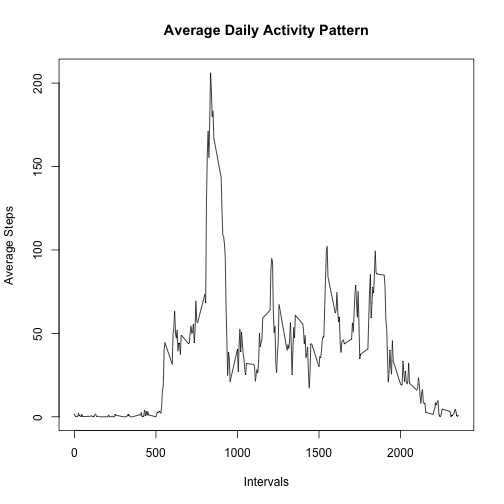
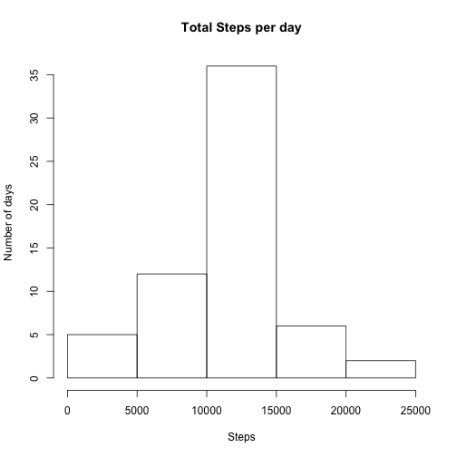
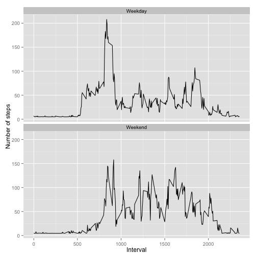

##Question 1 Loading and preprocessing the data

```r
x <- read.csv("activity.csv", colClasses=c("numeric", "Date", "integer"), stringsAsFactors=FALSE)
```
##Question 2 What is the mean total number of steps taken per day?

```r
z <- NULL
y <- NULL
z <- levels(as.factor(x$date)) 
for (i in z) y <- c(y, sum(x[x$date==i, 1]))
hist(y, main="Total Steps per day", xlab="Steps", ylab="Number of days")
```

 

```r
mean(y, na.rm=TRUE)
```

```
## [1] 10766.19
```

```r
median(y, na.rm=TRUE)
```

```
## [1] 10765
```
##Question 3 What is the average daily activity pattern?  

```r
z <- NULL
y <- NULL
z <- levels(as.factor(x$interval))
z<-as.integer(z)
for (i in z) y <- c(y, mean(x[x$interval==i, 1], na.rm=TRUE))
plot(z,y, type="l", xlab="Intervals", ylab="Average Steps", main="Average Daily Activity Pattern")
```

 
  
### Which 5 minute interval, on average is the top interval  

```r
x1 <- data.frame("interval"=z,"mean"=y)
x1[x1$mean==max(x1$mean),]
```

```
##     interval     mean
## 104      835 206.1698
```
##Question 4 Imputing missing values  
### 1. Calculate and report the total number of missing values in the dataset.  

```r
sum(!complete.cases(x))
```

```
## [1] 2304
```
### 2. Devise a strategy for filling in all the missing values. The strategy is going to be to use the average value so that it minimizes any effect. 
  
### 3. Create a new datset with the missing values filled in.
  

```r
x1 <- x
x1[!complete.cases(x1),1] <-mean(x[,1], na.rm=TRUE)
```
  
### 4. Make a histogram of the total number of steps taken each day.   


```r
z <- NULL
y <- NULL
z <- levels(as.factor(x1$date)) 
for (i in z) y <- c(y, sum(x1[x1$date==i, 1]))
hist(y, main="Total Steps per day", xlab="Steps", ylab="Number of days")
```

 
   
### Calculate and report the mean.

```r
avgy <- mean(y)
avgy
```

```
## [1] 10766.19
```
### Calculate and report the median.

```r
mdny <- median(y)
mdny
```

```
## [1] 10766.19
```
### Are these values different from the estimates in the first part of the assignment?  Not significantly although the median is slightly changed.  
  
###Are there differences in activity patterns between weekdays and weekends?    
### Yes  
### 1. Create a new factor variable in the dataset with two levels  – “weekday” and “weekend”  

```r
x1$dow <- weekdays(x1$date)
x1[x1$dow=="Saturday" | x1$dow=="Sunday", 4] <- paste("Weekend")
x1[x1$dow=="Monday" | x1$dow=="Tuesday" | x1$dow=="Wednesday" | x1$dow=="Thursday"| x1$dow=="Friday", 4] <- paste("Weekday")
x1$dow <- factor(x1$dow)  
```
### 2. Make a panel plot containing a time series plot (i.e. type = "l") of the 5-minute interval (x-axis) and the average number of steps taken, averaged across all weekday days or weekend days (y-axis).   

```r
library(ggplot2)
```

```
## Use suppressPackageStartupMessages to eliminate package startup messages.
```

```r
m <- NULL
y <- NULL
z <- levels(as.factor(x$interval))
z<-as.integer(z)
i <- NULL
for (i in z) y <- c(y, mean(x1[x1$interval==i & x1$dow =="Weekday", 1]))
i <- NULL
for (i in z) m <- c(m, mean(x1[x1$interval==i & x1$dow =="Weekend", 1]))
y1 <- cbind("interval"=z, "mean"=y)
m1 <- cbind("interval"=z, "mean"=m)
y1 <- data.frame(y1, stringsAsFactors=FALSE)
m1 <- data.frame(m1, stringsAsFactors=FALSE)
m1$dow <- rep("Weekend", 288)
y1$dow <- rep("Weekday", 288)
my1 <- rbind(m1,y1) 
my1$interval <- as.integer(my1$interval)
my1$mean <- as.numeric(my1$mean)
ggplot(my1, aes(x=interval, y=mean)) + geom_line() + facet_wrap(~ dow, nrow=2) + xlab("Interval") + ylab("Number of steps")
```

 
